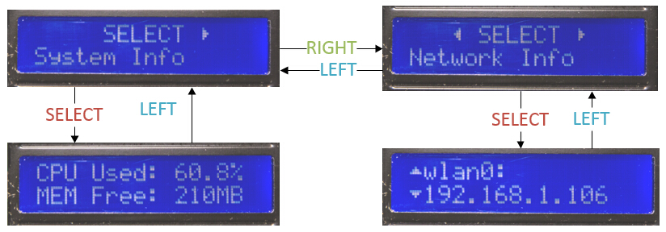
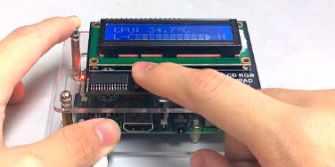

RaspberryPiKit
==============

Designed for Raspberry Pi! 
Base on Adafruit CharLCDPlate and Raspbian System.

## Prepare

1. 1602LCD Pad (You can buy it from Adafruit or TaoBao)
1. wiringPi `git clone git://git.drogon.net/wiringPi`

## src
### Monitor.py
You can retrieve system information such as: CPU used/ CPU Temperature/ Mem used/ Disk used/ Network infomation/... by use this moudle.

```python
# Example
print "CPU Temperature: ", str(SysInfo.getCpuTemperature())
print "CPU Used: ", str(SysInfo.getCpuInfo()['used'])
print "MEM Total: ", str(SysInfo.getMemInfo()['total'])
```

### Display.py
This is a LCD GUI moudle that have many convenient feature for your Pi:

1. A menu included `System Info` `Network Info`..etc which allow you controlling by key pad.
1. You can add `sudo python Display.py` script to `/etc/rc.loacl` then you can run it automatic during system boot.
1. You can get your Pi's IP address without use additional screen or search on routing table! That was a big reason why I made it:)

## Gallary

  - Easy and useful. Feel Free to explore.
  
    

  - You can wacthing the demo online.
  
    [](http://v.youku.com/v_show/id_XNzc0Njc3NTE2/v.swf.html)
